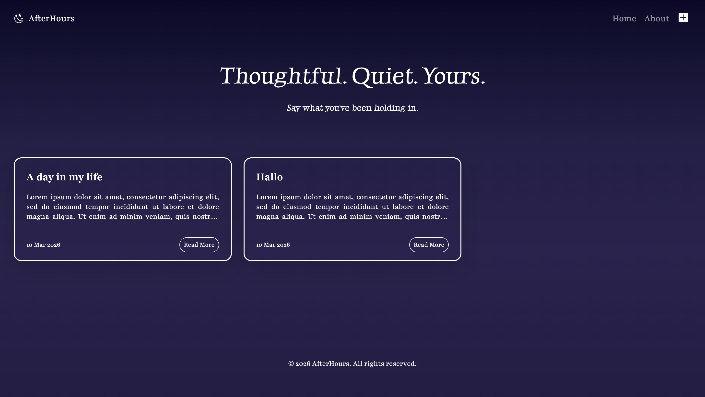
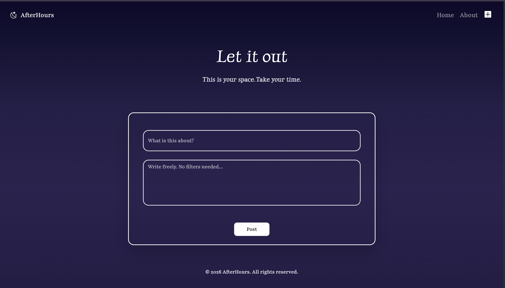
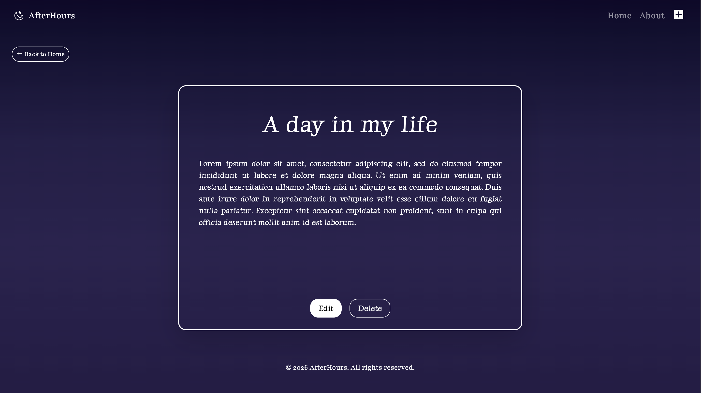
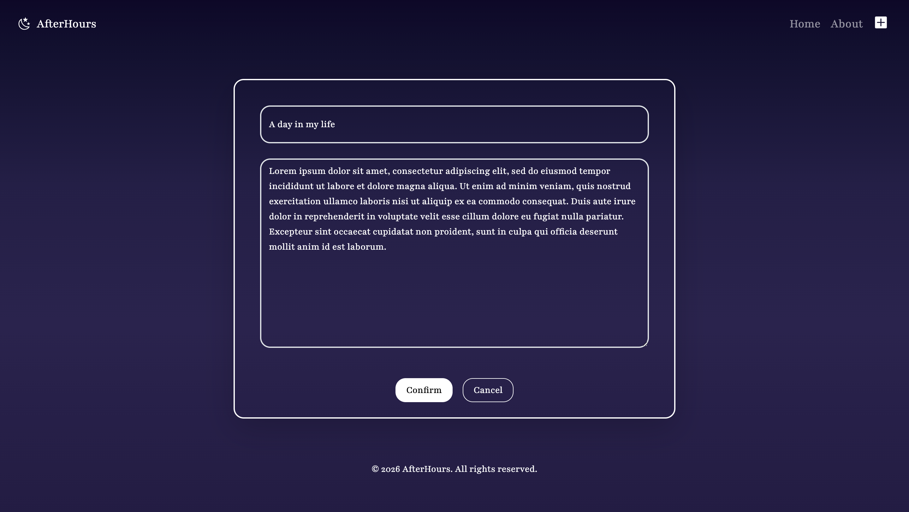

# AfterHours 🌌

**A quiet corner of the web to share your thoughts freely.**  

> Part of my **Capstone Project** for learning **Express.js, EJS templating, Bootstrap 5, and Node.js**.  
> The goal: build a full-stack web app from scratch, handling routing, dynamic content, forms, and deployment.  

[](https://nodejs.org/) [](https://expressjs.com/) [](https://getbootstrap.com/)  


---

## 🌟 Features

- Write, edit, and delete posts freely  
- View thoughts in a **responsive, animated card layout**  
- Hover on `+` to “create new post”  
- Mobile-friendly & cozy design  
- Posts show **date in DD/MM/YYYY** 

---

## 📸 Screenshots

### Homepage and Create Post 
<p align="center">
  
  
</p>

### View Post and Edit Post
<p align="center">
  
  
</p>

## ✨ Live Demo 
[Visit AfterHours Live](https://after-hours-blog.onrender.com/)  

---

## 🚀 Tech Stack

- **Backend:** Node.js + Express.js  
- **Frontend:** EJS + Bootstrap 5 + CSS  
- **Deployment:** Render  

---

## 💻 Local Setup

```bash
git clone https://github.com/yourusername/AfterHours.git
cd AfterHours
npm install
npm start
```

---

## 🧠 What I Learned

Through building this project, I learned how to:

- Build a backend server using **Express.js**
- Use **EJS templating** to render dynamic pages
- Implement **CRUD operations** (Create, Read, Update, Delete)
- Structure an Express project with **views, partials, and public folders**
- Handle **form submissions with POST requests**
- Create dynamic routes using **URL parameters**
- Deploy a Node.js application using **Render**

---

## 🚀 Future Improvements
- 🗄️ Connect to a **database (MongoDB / PostgreSQL)** instead of storing posts in memory
- 🔐 Add **user authentication** (login & registration)
- ❤️ Add **like or reaction features**
- 🔎 Implement **search or filtering for posts**

---

## 📜 License

This project is licensed under the **MIT License**.

You are free to use, modify, and distribute this project for educational purposes.

See the [LICENSE](LICENSE) file for full details.
